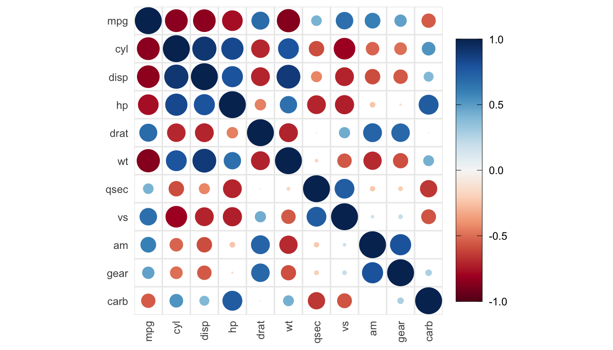
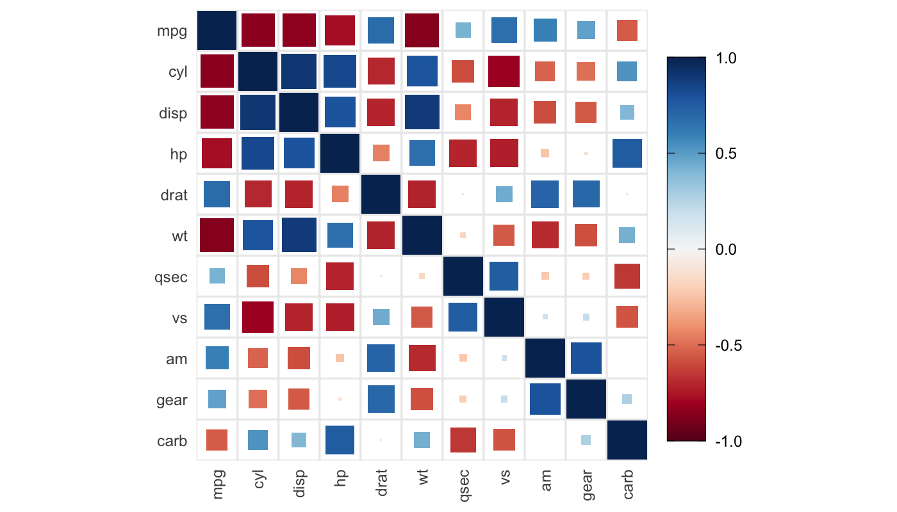
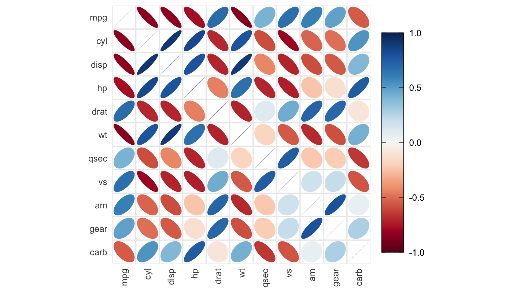
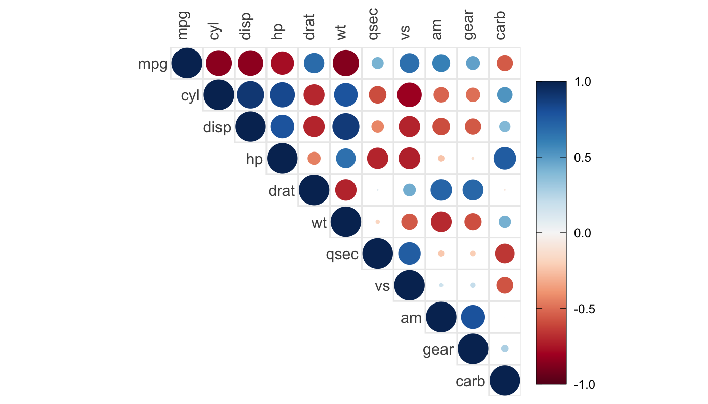
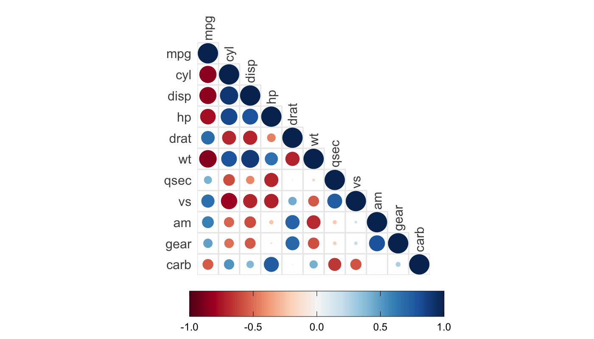
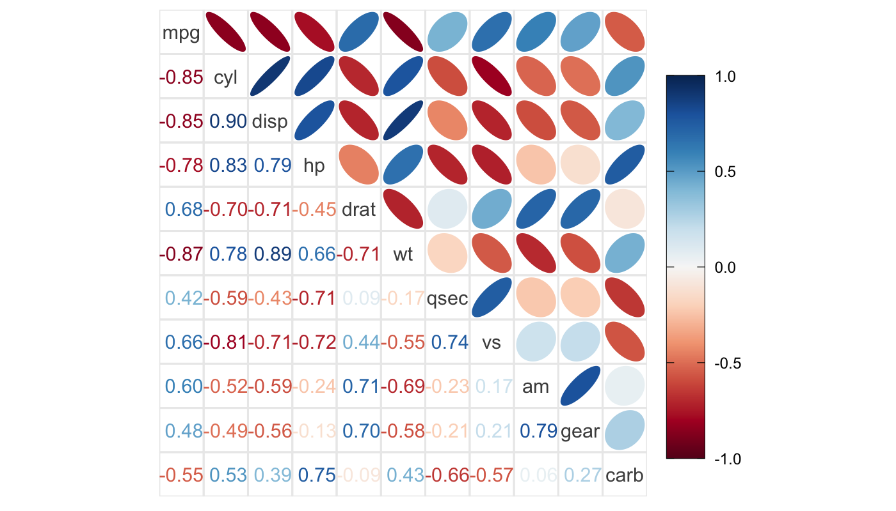
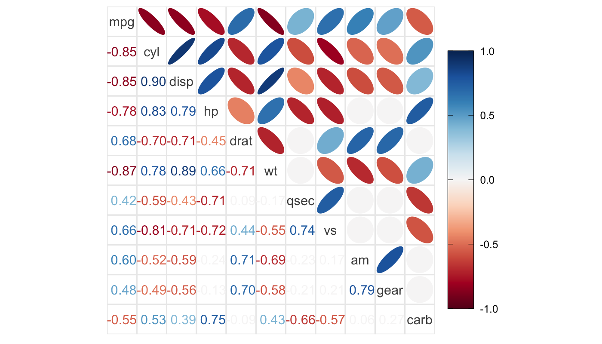
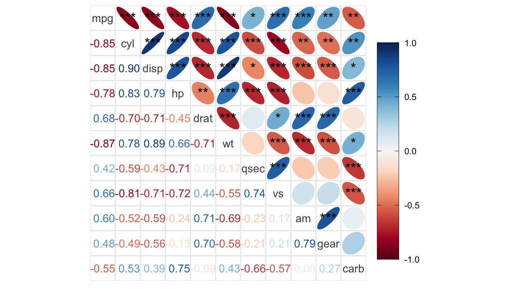
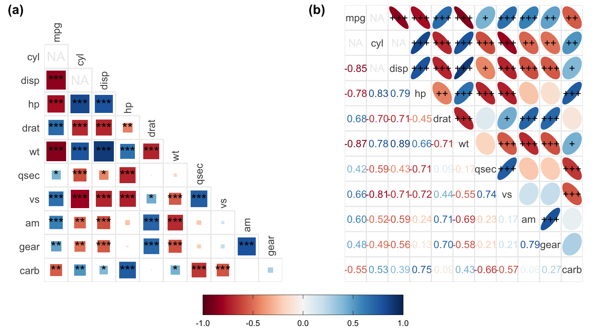

# ggcorrplot2

[](https://travis-ci.org/caijun/ggcorrplot2)

Implementation of corrplot using ggplot2

## Introduction

Reinventing wheels is not what I like doing.
[corrplot](https://CRAN.R-project.org/package=corrplot) is a great R
package, but I am really tired of customizing the appearance of
corrplot, for example, the space between colorbar and its tick labels,
the space around the plot that I don’t know how to control when writing
it to PDF on my macOS. This is most likely because I am more familiar
with the Grammar of Graphics implemented in ggplot2 than the base
plotting system in R. There are several R packages (e.g.,
[ggcorrplot](https://github.com/kassambara/ggcorrplot) developed by
Alboukadel Kassambara, [ggcorr](https://github.com/briatte/ggcorr)
developed by François Briatte) that can visualize a correlation matrix
into a
[corrgram](https://www.tandfonline.com/doi/abs/10.1198/000313002533)
using ggplot2; however, they are unable to visualize a correlation
matrix using ellipse and mixed methods. **ggcorrplot2** has implemented
only a subset of features of **corrplot** to meet my urgent needs. See
examples in the **Getting started** section. More functionality will be
added in the future as needed.

## Installation

Get the development version from github:

``` r
if (!requireNamespace("devtools")) install.packages("devtools")
devtools::install_github("caijun/ggcorrplot2")
```

## Getting started

The `mtcars` dataset will be used to demonstrate the usages of
**ggcorrplot2**. Most parameters of **ggcorrplot2** functions are the
same as those of **corrplot**. Therefore, it’s easy for users to migrate
from **corrplot** to **ggcorrplot2**.

``` r
library(ggcorrplot2)

data(mtcars)
# Use corr.test() from psych package to calculate the correlation matrix and 
# corresponding p value matrix without adjustment.
library(psych)
ct <- corr.test(mtcars, adjust = "none")
corr <- ct$r
p.mat <- ct$p

# Visualize the correlation matrix
# --------------------------------
# method = "circle" (default)
ggcorrplot(corr)
```

<!-- -->

``` r
# method = "square"
ggcorrplot(corr, method = "square")
```

<!-- -->

``` r
# method = "ellipse"
ggcorrplot(corr, method = "ellipse")
```

<!-- -->

``` r
# method = "number", display the correlation coefficients
ggcorrplot(corr, method = "number")
```

<!-- -->

``` r
# Visualize the upper or lower triangle of correlation matrix
# -----------------------------------------------------------
# the upper triangle
ggcorrplot(corr, type = "upper")
```

<!-- -->

``` r
# the lower triangle
ggcorrplot(corr, type = "lower")
```

<!-- -->

``` r
# Visualize the correlation matrix using mixed methods
# ----------------------------------------------------
# default: upper = "circle", lower = "number"
ggcorrplot.mixed(corr)
```

<!-- -->

``` r
# upper = "ellipse", lower = "number"
ggcorrplot.mixed(corr, upper = "ellipse", lower = "number")
```

<!-- -->

``` r
# Combine correlogram with the significance test
# ----------------------------------------------
# Insignificant coefficients according to the default significant level 
# (sig.lvl = 0.05) are indicated by X by default.
ggcorrplot.mixed(corr, upper = "ellipse", lower = "number", p.mat = p.mat)
```

<!-- -->

``` r
# Leave blank on insignificant coefficients
ggcorrplot.mixed(corr, upper = "ellipse", lower = "number", p.mat = p.mat, 
                 insig = "blank")
```

<!-- -->

``` r
# Label significant coefficients with asterisks (*, default) denoting the significance level
ggcorrplot.mixed(corr, upper = "ellipse", lower = "number", p.mat = p.mat, 
                 insig = "label_sig", sig.lvl = c(0.05, 0.01, 0.001))
```

<!-- -->

``` r
# Label significant coefficients with varying number of + denoting the significance level
(p <- ggcorrplot.mixed(corr, upper = "ellipse", lower = "number", p.mat = p.mat, 
                 insig = "label_sig", sig.lvl = c(0.05, 0.01, 0.001), pch = "+", 
                 pch.cex = 4))
```

<!-- -->

The above examples reproduce some features of **corrplot**. In the
following example, the added advantages of implementing **corrplot**
using ggplot2, such as customizing the appearance of corrgram, combining
a corrgram with other plots (including non-corrgrams) into one plot
using [cowplot](https://github.com/wilkelab/cowplot), are demonstrated.

``` r
# Customize the appearance of corrplot using functions from ggplot2
library(ggplot2)
# Use different color palette
col1 <- colorRampPalette(c("#7F0000", "red", "#FF7F00", "yellow", "white",
                           "cyan", "#007FFF", "blue", "#00007F"))
# Change the colorbar direction to horizontal and place it at the bottom
# As mixed methods are used, there are two scales: color filled in ellipse and 
# number color
p <- p + scale_fill_gradientn(colours = col1(10), limits = c(-1, 1),
                                guide = guide_colorbar(
                                  direction = "horizontal",
                                  title = "",
                                  nbin = 1000,
                                  ticks.colour = "black",
                                  frame.colour = "black",
                                  barwidth = 15,
                                  barheight = 1.5)) +
  scale_colour_gradientn(colours = col1(10), limits = c(-1, 1),
                       guide = guide_colorbar(
                         direction = "horizontal",
                         title = "",
                         nbin = 1000,
                         ticks.colour = "black",
                         frame.colour = "black",
                         barwidth = 15,
                         barheight = 1.5)) +
  theme(legend.position = "bottom")
p
```


``` r
# Combine a lower corrgram and a mixed corrgram side by side with a shared colorbar on the bottom

# NAs are allowed in correlation matrix and p value matrix, which are labelled as NA
# Assign NAs
rid <- c(2, 3, 1, 2)
cid <- c(3, 2, 2, 1)
pos <- cbind(rid, cid)
corr[pos] <- NA
p.mat[pos] <- NA

# a lower corrgram
p1 <- ggcorrplot(corr, type = "lower", method = "square", p.mat = p.mat, 
                 insig = "label_sig", sig.lvl = c(0.05, 0.01, 0.001), show.diag = FALSE)
# a mixed corrgram
p2 <- ggcorrplot.mixed(corr, upper = "ellipse", lower = "number", p.mat = p.mat, 
                       insig = "label_sig", sig.lvl = c(0.05, 0.01, 0.001), 
                       pch = "+", pch.cex = 4)

library(cowplot)
prow <- plot_grid(p1 + theme(legend.position = "none"),
                  p2 + theme(legend.position = "none"),
                  rel_widths = c(1, 1), nrow = 1, align = 'hv',
                  labels = c("(a)", "(b)"), label_x = 0, label_y = 1)

# Extract the legend from the first corrgram
legend <- get_legend(p1)
# Add the legend to the bottom of the plot row we made earlier.
p <- cowplot::plot_grid(prow, legend, ncol = 1, rel_heights  = c(1, 0.15))
p
```



## Citation

To cite the ‘ggcorrplot2’ package in publications use:

      Jun Cai, Granville Matheson and Samson Leonard Daniël (2022). ggcorrplot2: Visualize a Correlation Matrix using ggplot2. R package version 0.1.2.

A BibTeX entry for LaTeX users is

      @Manual{,
        title = {ggcorrplot2: Visualize a Correlation Matrix using ggplot2},
        author = {Jun Cai and Granville Matheson and Samson Leonard Daniël},
        year = {2022},
        note = {R package version 0.1.2},
        url = {https://github.com/caijun/ggcorrplot2},
      }

The above citation information can be generated by calling
`citation("ggcorrplot2")` in R.

## Contact

Bugs and feature requests can be filed to
<https://github.com/caijun/ggcorrplot2/issues>. Pull requests are also
welcome.
